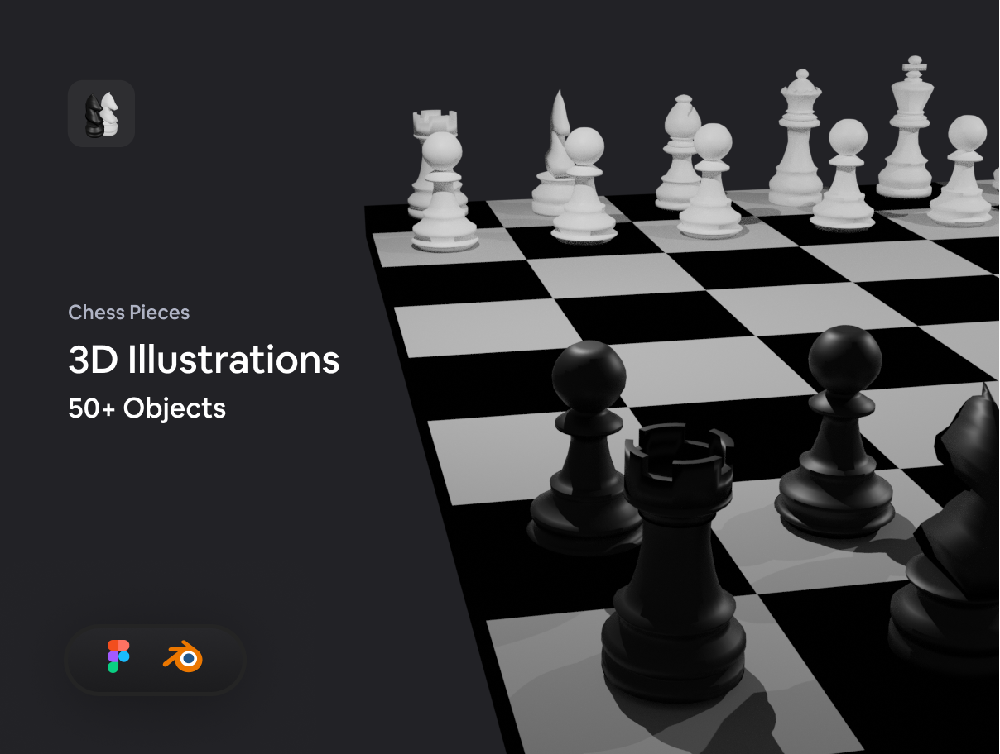
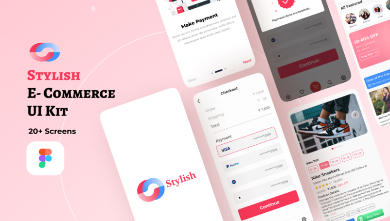
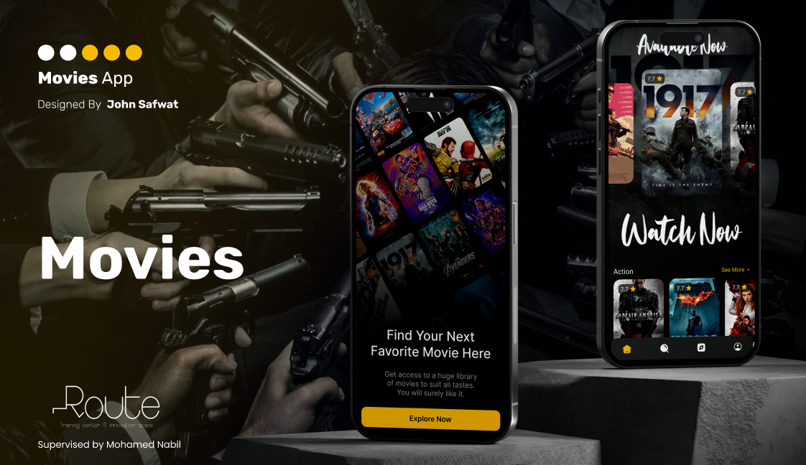
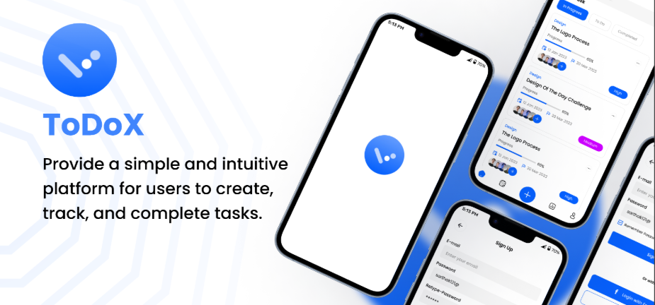
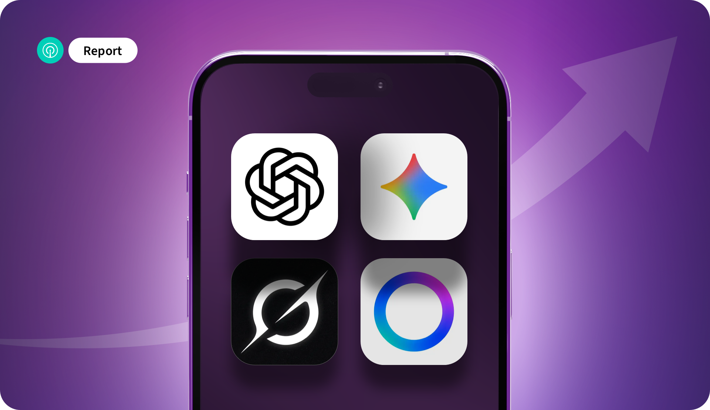

# Abdelrhman Mohamed  
**Software Engineer - Flutter Developer**

Hi! I'm **Abdelrhman Mohamed**, a passionate mobile app developer specializing in **Flutter**. I focus on building high-performance, cross-platform apps with smooth user experience and clean, modern UI designs.  

---

## 📝 Table of Contents
- [About Me](#about-me)
- [Skills](#skills)
- [Projects](#projects)
- [Screenshots](#screenshots)
- [Contact](#contact)

---

## About Me
I am a mobile app developer with extensive experience in **Flutter** and cross-platform development. I also have experience integrating software with hardware, such as in my **Smart Chess** graduation project. I am dedicated to continuous learning and keeping up with the latest technologies in mobile development.  

---

## Skills

### Programming & Concepts
- Dart (OOP) | C++ | Python  
- Clean Code | SOLID Principles | Data Structures | Problem Solving  
- Git | Agile Methodologies  

### Flutter Development
- Cross-platform Mobile Apps  
- UI/UX Implementation  
- State Management (Bloc | Cubit | GetX)  
- RESTful API Integration | Deployment | CI/CD | Testing & Debugging  

### Architecture & Patterns
- MVVM | Clean Architecture | BLoC Pattern | MVC  

### Firebase & Backend Integration
- Firestore | Firebase Storage | Firebase Cloud Messaging  

### Local Storage
- SQLite | Hive | Shared Preferences  

### Tools & Other Skills
- GitHub | VS Code | Android Studio  
- Communication | Teaching & Mentoring  

---

## Projects

### 1. Smart Chess – Graduation Project
**Technologies:** Flutter | Arduino | Raspberry Pi  
**Description:**  
Developed a smart chess board integrating hardware and a mobile app.  
Led the app UI/UX and contributed to hardware logic.  
**Achievements:** Ranked Excellent with Honors  
**Repo:** [GitHub](https://github.com/AbdelrhmanMohameddd)  

### 2. E-Commerce App
**Technologies:** Flutter | RESTful API  
**Description:**  
An online shopping app with login, product browsing, cart, and order tracking.  
**Repo:** [GitHub](https://github.com/AbdelrhmanMohameddd)  

### 3. Movies App
**Technologies:** Flutter | REST API  
**Description:**  
An app to explore trending and upcoming movies with search, filters, and detailed information.  
**Repo:** [GitHub](https://github.com/AbdelrhmanMohameddd)  

### 4. To-Do App
**Technologies:** Flutter | Sqflite | Bloc  
**Description:**  
Task management app with add/edit/delete functionality, date filters, and clean UI design.  
**Repo:** [GitHub](https://github.com/AbdelrhmanMohameddd)  

---

## Screenshots
You can add project screenshots here to showcase UI and design:

  
  
  
  
  
  

> Place your screenshots in the `assets/screenshots/` folder or use direct online links.

---

## Contact
- **Email:** abdelrhman.mohamed@ieee.org  
- **LinkedIn:** [linkedin.com/in/abdulrahmanmohamd](https://www.linkedin.com/in/abdulrahmanmohamd/)  
- **GitHub:** [github.com/AbdelrhmanMohameddd](https://github.com/AbdelrhmanMohameddd)  
- **Phone:** +201278814819

---
